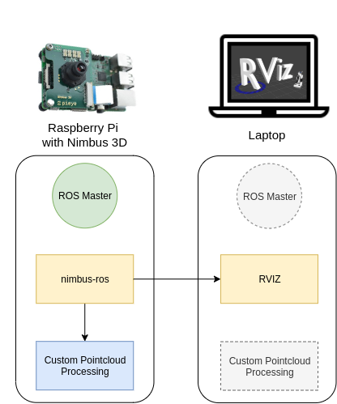

# Nimbus 3D Camera ROS driver.
Under development

## Installation

1. Prepare Enviroment
    * Clone this Repository in the src folder of your ROS workspace 
    ``` 
    mkdir -p ~/catkin_ws/src
    cd ~/catkin_ws/src
    git clone https://github.com/pieye/nimbus-userland.git
    ``` 

    * [Install](https://github.com/pieye/nimbus-userland/blob/master/README.md) the required software packages for nimbus
    * [Install ROS Melodic from Source](https://github.com/curl/curl)  on Raspian OR run the following install script: 
    ``` 
    sudo ./install.sh
    ``` 
    
2. Configure [ROS to run accros multiple machines](http://wiki.ros.org/ROS/Tutorials/MultipleMachines)
    The following Diagramm shows the possible architectures for using the nimbus. The ROS driver "nimbus_ros" is running on the RaspberryPi and publishes the pointcloud. In this guide the master is running also on the Pi, but it could run on any other machine in the local network. The Pointcloud is afterwards visualized on another Computer with a Display e.g. Laptop. Your algorithms to process the captured data can run locally on your Raspberry have a highly integrated vision system or run on a more powerful device.  


    


    * We now configure ROS to run the master on the Raspberry and access the data via another machine running ROS Melodic with RVIZ installed
    * Add this line to the .bashrc of your other machine (laptop), after adapting the IP to your Raspberry
    ```
    nano ~/.bashrc
    export ROS_MASTER_URI=http://192.168.1.1:11311
    ```
    * SSH into your Raspberry and run:
    ```
    roscore
    ```
    * Start RVIZ on your laptop:
    ```
    rviz
    ```
    It should start if everything works as axpected.
    


3. Run the Node
    * Change the ip addr in `main.cpp`(This will be change in future).
    * `rosrun nimbus_ros nimbus_ros_node`


### Results
